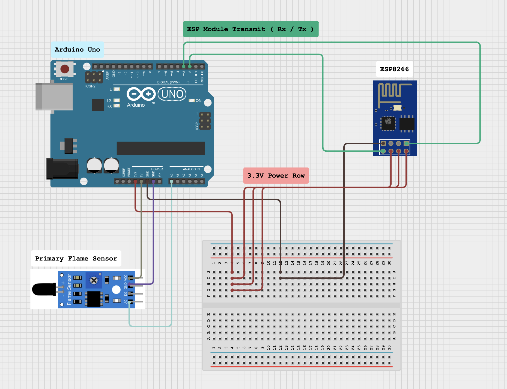

# 🤖 Fire Detector (Arduino)

## Overview

This simple yet effective project is a fire detector that uses an Arduino Uno and a simple flame sensor module to detect sudden changes in the thermal environment around it and alert the user via playing an alarm sound and also sending the raw readings to the serial monitor, which also gets used by the backend to send emails to all of the addresses assigned.

### Reason behind creation

This project was primarily made for one of the science fests that are arranged in our college every year. It was also a learning attempt for me to try and get used to building various combinations of circuits using Arduino and tinker around with various different sensors and modules.

---

## Setup

### Required technologies

- C++ (Arduino, for the main code and TCP server)
- Python (for the mailing and TCP client)
- Hardware:
    - Arduino Uno
    - Flame Sensor Module
    - ESP8266 ESP-01 Module
    - Jumper Wires (approx. 11)
    - Breadboard (small)

### Making the circuit

The circuit diagram for this project is very simple. If you'd like to preview this diagram in real time, fear not! It has been designed using the [Cirkit Designer](https://www.cirkitstudio.com) program. See [this directory](diagram) for the project resources.



### Code structure

The source code has been divided into two parts:

1. The code for the Arduino Uno, which is responsible for preparing the ESP8266 module as both a wireless device and a TCP server, reading the sensor data and sending it over both the serial port and the TCP protocol.

2. The code to run on a local machine, which is responsible for sounding the alarm and sending emails to all of the addresses assigned in the code.

Before we can get into hosting the source, we'll have to make sure that the environment has been setup properly.

### Code editor requirements

- [Visual Studio Code](https://code.visualstudio.com) is the preferred code editor for this project. It is lightweight, has a built-in terminal, and has a wide range of extensions available for it. The required configuration has been placed inside the **.vscode** directory. 

- [PlatformIO](https://platformio.org) is used as the main extension for this project, which is a powerful, open source ecosystem for IoT development. Instead of using the default Arduino IDE for writing and uploading the scratches to our device, we can use it to do the same thing.

- [Python 3.12](https://www.python.org/downloads) is required to run the backend code. It is a powerful, flexible, and easy-to-learn language that is used in a wide range of applications. The required packages have been placed inside the **requirements.txt** file.

- [A C++ compiler](https://gcc.gnu.org) is needed to build and upload scratches to the Arduino Uno. In our case, PlatformIO generally prefers system-specific GCC toolchain to do so. <br>

### Cloning the GitHub repository

First of all we'll need to prepare the project files in our local machine by cloning the repository into any directory of our choice. We can do so using either of the following commands below:

```bash
# uses HTTPS
git clone https://github.com/hitblast/ArduinoFireDetector.git

# uses SSH
git clone git@github.com:hitblast/ArduinoFireDetector.git
```

Later, we can navigate into our directory:

```bash
cd ArduinoFireDetector
```

### Setting up the environment variables

```bash
# Create a .env file for storing the credentials.
cp .env.sample .env

# Open it in Visual Studio Code. You can also use any other text editor of your choice.
code .env
```

It should look something like this:

```env
MAIN_EMAIL=
MAIN_EMAIL_PASSWORD=
SKIP_SERIAL_CONN=
SKIP_ALARM=
SKIP_EMAIL=
```

Out of these five variables, only `MAIL_EMAIL` and `MAIL_EMAIL_PASSWORD` are required and others default to `False`. 
Note that you cannot provide your default email credentials here since it'd turn into a security risk. Instead, we can create our virtual app using our email address. 

- In the case of Google, use [this guide right here](https://support.google.com/accounts/answer/185833?hl=en) to create **App Passwords** inside your Google Account. Then, use the generated password as the `MAIN_EMAIL_PASSWORD` value.

### Installing the dependencies

Once the environment variables are set up, we'll need to create a new virtual environment in Python and use it as a base for installing the required packages. Visual Studio Code will automatically detect this and after we've set it up, it will generally prefer the virtual environment instead of the global one.

```bash
# Create a new virtual environment
python -m venv venv

# Activate it
source venv/bin/activate

# Update pip and install the required packages
pip install --upgrade pip
pip install -r requirements.txt
```

### Uploading the code to the Arduino Uno

Now that we have everything set up, we can upload the code to the Arduino Uno. We can do so by connecting the Arduino to our computer using a **USB to Serial cable.** Then, we can open Visual Studio Code. Once it has done setting up the environment, we can use the built-in command palette to upload our code.

1. Press `Ctrl + Shift + P` to open the command palette.
2. Look up `PlatformIO: Upload and Monitor`.
3. Press `Enter` to upload the code to the Arduino Uno.

For the first build, it might take some time to compile, verify and upload the scratch. Once it's done, it'll automatically start monitoring the serial port for any incoming data. We can use this to verify that the code is working as expected. Later, close the serial monitor and proceed to the next step.

### Running the backend

In order for the alarm and email system to work, navigate into the `src/` directory and run the `client.py` Python script using the following commands

```bash
# Activate virtual environment if not (or closed previously)
source venv/bin/activate

# Navigate into the src directory
cd src

# Run the Python script
python client.py
```

We can also do this using the built-in "Play" button inside Visual Studio Code. Just choose the `client.py` file and press the button around the top right corner to run the script.